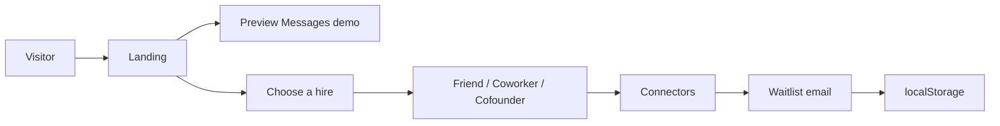
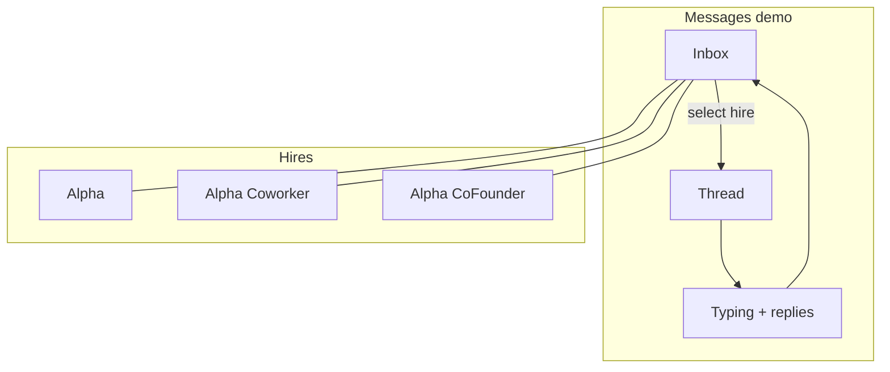

# HireAlpha

Marketing site for **HireAlpha**: three hireable agents that live in iMessage.

Each hire is a distinct contact with its own number and personality. Not one chatbot with modes.

| Hire | In Messages as | Role | Price |
| --- | --- | --- | --- |
| Friend | `Alpha` | Personal companion | $19/mo |
| Coworker | `Alpha (Coworker)` | Work colleague | $19/mo |
| Cofounder | `Alpha(CoFounder)` | Startup partner | $19/mo |

This repo is the landing experience: product story, interactive Messages demo, connectors grid, and waitlist capture.

---

## Preview

| Hero / phone demo | Roles |
| --- | --- |
|  |  |

| Coworker | Cofounder |
| --- | --- |
|  |  |

---

## Product flow





---

## What’s in the page

1. **Hero** — product line + live iPhone / Messages demo  
2. **Roles** — three hire cards with Messages display names  
3. **Connectors** — brand icons for Gmail, Calendar, Slack, Notion, and more  
4. **How it works** — choose → get a number → text  
5. **Waitlist** — email form (client-side only for now)

The phone demo cycles inbox → thread → typing bubbles for the focused hire.

---

## Stack

| Layer | Choice |
| --- | --- |
| App | React 19 + TypeScript |
| Bundler | Vite 8 |
| Motion | Framer Motion |
| Icons | Simple Icons |
| Lint | Oxlint |

No backend in this repo. Waitlist emails are stored in `localStorage` under `hirealpha-waitlist`.

---

## Project layout

```text
src/
  App.tsx          # Landing UI, agents, phone demo, connectors, waitlist
  index.css        # Design system + section styles
  main.tsx         # Entry
public/
  images/          # Preview assets
  favicon.svg
scripts/
  clean-dev.sh     # Kill stale Vite ports and restart
```

---

## Develop

```bash
npm install
npm run dev
```

```bash
npm run build
npm run preview
npm run lint
```

Optional clean restart:

```bash
bash scripts/clean-dev.sh
```

---

## Environment

Do not commit secrets.

```text
.env
.env.*
```

These are ignored by `.gitignore`. Add a `.env.example` when server keys are introduced.

---

## Marketing & growth tools

Turnkey pieces that were added alongside the marketing plan in
`marketing/launch-kit/` (Show HN post, Product Hunt copy, X threads, community
posts, launch-day checklist — all grounded in verified facts).

- **Analytics.** Self-hosted Plausible Community Edition on Coolify at
  `https://analytics.hirealpha.chat` — deploy it from `deploy/plausible/`
  (see its README; ~5 steps, free forever). `index.html` loads the snippet for
  domain `hirealpha.chat`, and pageviews + the custom funnel events fire
  automatically: `waitlist_joined` (with `hire` and `via` props),
  `checkout_started` (`plan`, `persona`), `share_clicked`, `invite_copied`.
  Register the site + define the events under Plausible → Settings → Goals.
- **Waitlist → email.** Every new waitlist email is pushed to a Resend audience
  (`RESEND_API_KEY` + `RESEND_AUDIENCE_ID`, see `.env.example`) so you can send
  the launch sequence from the Resend dashboard. Existing signups backfill with
  `bun scripts/sync-waitlist-resend.ts`.
- **Referral program.** Members mint 3 one-use codes (`/api/invites/for-phone`).
  Friends enter a code in the waitlist form (or the app redeem endpoint); each
  redemption is recorded on the referrer in `hire_invites`, and every 3
  redemptions earns a "free month" row in `hire_referral_rewards`. The backend
  records the ledger; *applying the free-month credit at checkout is a billing
  workstream still to be implemented* — the UI copy is written to match.
- **Greatest hits wall.** The homepage "Texting a hire looks like this." section
  renders `src/data/highlights.ts`. Entries are illustrative sample threads;
  replace them with real (consented, redacted) conversations over time.
- **SEO pages.** `/faq` serves a static FAQ with FAQPage schema targeting
  long-tail searches ("AI friend that texts first", "AI coworker for email",
  "AI cofounder for startups").

## Status

Frontend landing only. SMS numbers, billing, and connector OAuth are not implemented here yet.
