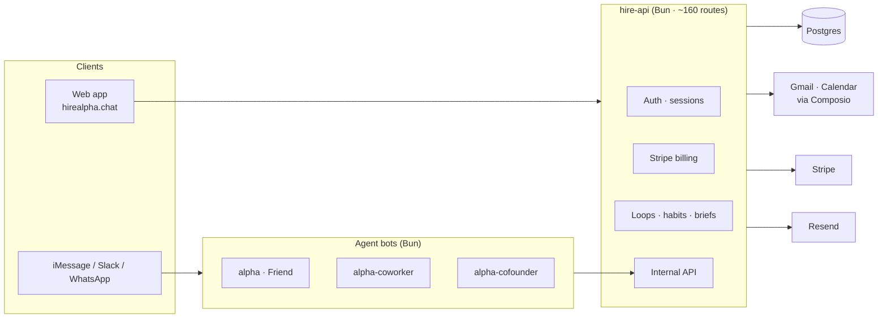

# HireAlpha

**Three hireable agents that live in iMessage.** Each hire is a distinct contact with its own phone number and personality — not one chatbot with modes.

| Hire | In Messages as | Role | Price |
| --- | --- | --- | --- |
| Friend | `Alpha` | Personal companion — briefs, body, money, people | $19/mo |
| Coworker | `Alpha (Coworker)` | Work colleague — standup, drafts, triage, loops | $19/mo |
| Cofounder | `Alpha(CoFounder)` | Startup partner — pipeline, decisions, investor notes | $19/mo |

Text them like a person. They answer with running software: mini-apps open **inside the thread** — approve-a-draft, pick-a-slot, spending snapshots, evening briefs — built on your Gmail, Calendar, bank, and habits.

---

## Architecture



**One turn, end to end:** a text lands on the hire's number → the bot's turn engine (`spectrum/shared/runHireTurn.ts`) classifies intent, runs tools, and either replies in bubbles or opens a mini-app card → the card talks to `hire-api`, which enforces auth + billing and reads/writes Postgres. Every surface (thread, web home screens, briefs) shares one action layer (`src/platform/actionRunner.ts`) so a "Do" button works everywhere, not just where it was first built.

---

## Repo map

```text
src/                     # Frontend (React 19 + Vite 8 + TypeScript)
  Landing.tsx            #   Marketing site: demo phone, roles, connectors, waitlist
  marketing/             #   Pricing, FAQ, launch surfaces
  platform/              #   The logged-in app: home screens + 30+ mini-apps
    api.ts               #     Typed API client
    actionRunner.ts      #     Shared run/snooze/open verbs (thread + web + brief)
    miniAppCatalog.ts    #     App catalog: menus, aliases, store groups
  data/highlights.ts     #   "Greatest hits" wall sample threads

spectrum/                # The three hires (Photon Spectrum bots, Bun)
  alpha/                 #   Friend  · alpha-coworker/ · alpha-cofounder/
  shared/                #   Turn engine, mini-app triggers, reminders, digests
  docker-entrypoint.sh   #   One image, HIREALPHA_BOT picks the hire

deploy/                  # Backend
  hire-api.ts            #   The API: auth, billing, loops, briefs, internal API
  web-server.ts          #   Static server for dist/ with preload hints
  gmailHelpers.ts …      #   Mail triage, calendar windows, timezones, caching
  nginx-web.conf         #   Production proxy config

services/                # Agent toolbelt: browser (Playwright), search,
                         # code interpreter, n8n, payments + stress tests

scripts/                 # deploy-prod.sh, start-spectrum.sh, clean-dev.sh,
                         # sync-waitlist-resend.ts

marketing/launch-kit/    # Show HN / Product Hunt / X copy, fact-grounded
video/                   # Remotion promo (renders out/promo.mp4)
deploy/plausible/        # Self-hosted analytics (Coolify compose)
```

---

## Quick start

**Frontend** (Node 20+):

```bash
npm install
npm run dev        # http://localhost:5173
npm run build      # typecheck + production bundle → dist/
npm run preview
```

**Bots** (Bun):

```bash
# set GMI_API_KEY in each spectrum/*/.env
bash scripts/start-spectrum.sh          # all three
cd spectrum/alpha && bun start          # or one at a time
```

**Backend:**

```bash
bun deploy/hire-api.ts                   # needs DATABASE_URL + HIREALPHA_INTERNAL_KEY
bun deploy/web-server.ts                 # serves dist/ in front of the API
```

See [`spectrum/README.md`](spectrum/README.md) for per-bot env, phone numbers, and Coolify wiring.

---

## Tests & quality

```bash
bun test spectrum/shared/ deploy/ services/   # 821 tests across 42 files
npm run lint                                  # oxlint — 0 warnings, 0 errors
npm run build                                 # tsc -b + vite, CI-clean
```

The test suite covers the parts that hurt when they break: mini-app text triggers, turn gating and honesty guards, mail classification, timezone/DST windows, billing, referrals, password auth, and the API route handlers (with SQL fakes).

---

## Deployment

Production runs at **https://hirealpha.chat** on Coolify:

- `Dockerfile` builds all three hires from one image; set `HIREALPHA_BOT=friend|coworker|cofounder` per app. Health: `GET /healthz` on port 3000.
- The web app + API run behind `deploy/web-server.ts` + `deploy/nginx-web.conf`; `scripts/deploy-prod.sh` rebuilds the frontend, uploads it, restarts services, and verifies health.
- Analytics: self-hosted Plausible (`deploy/plausible/`) with funnel events (`waitlist_joined`, `checkout_started`, `share_clicked`, `invite_copied`).

---

## Environment

Copy `.env.example`. Never commit secrets. The high-level split:

| Var | Who needs it | What for |
| --- | --- | --- |
| `DATABASE_URL` | API | Postgres |
| `HIREALPHA_INTERNAL_KEY` | API + bots | Shared secret for the internal API |
| `STRIPE_SECRET_KEY`, `STRIPE_WEBHOOK_SECRET`, `STRIPE_PRICE_*` | API | Billing (auto-gated when set; `BILLING_ENFORCE=1` to hard-enforce) |
| `PROJECT_ID`, `PROJECT_SECRET`, `GMI_API_KEY`, `GMI_MODEL` | Bots | Spectrum project + LLM |
| `HIREALPHA_API_URL` | Bots | Where the API lives |
| `RESEND_API_KEY`, `RESEND_AUDIENCE_ID` | API | Waitlist → email audience |


---

## Marketing & growth

Turnkey pieces grounded in the verified fact sheet in `marketing/launch-kit/00-facts.md`:

- **Launch kit.** Show HN post, Product Hunt tagline + first comment, a week of X threads, community posts — all built from real screenshots.
- **Waitlist → email.** Signups push to a Resend audience; backfill with `bun scripts/sync-waitlist-resend.ts`.
- **Referral program.** Members mint 3 one-use codes (`/api/invites/for-phone`); every 3 redemptions earns a free-month row in `hire_referral_rewards`. The ledger is server-side; applying the credit at checkout is the remaining billing workstream.
- **SEO.** `/faq` serves FAQPage schema targeting long-tail queries ("AI friend that texts first", "AI coworker for email", …).
- **Greatest hits wall.** The homepage renders `src/data/highlights.ts` — illustrative sample threads today, designed to be replaced with real (consented, redacted) conversations.

---

## Status

- **Live:** landing + waitlist, Friend hire in iMessage, web app + mini-apps, Stripe checkout, referral ledger, analytics.
- **In progress:** Coworker/Cofounder rollout, annual-plan proration, referral credit redemption at checkout.

This is a working product, not a demo — but read [`marketing/launch-kit/00-facts.md`](marketing/launch-kit/00-facts.md) before writing any public copy: it is the only source of claims you may make.
