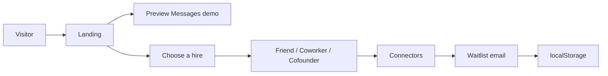
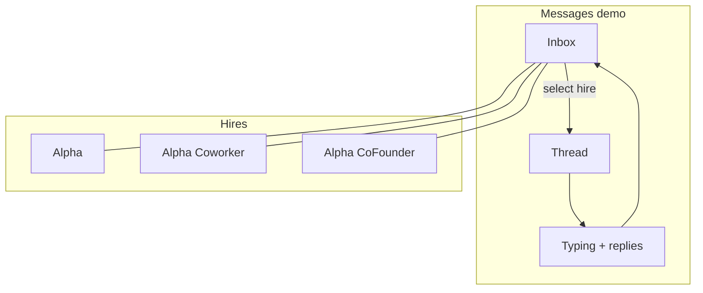

# HireAlpha

Marketing site for **HireAlpha**: three hireable agents that live in iMessage.

Each hire is a distinct contact with its own number and personality. Not one chatbot with modes.

| Hire | In Messages as | Role | Price |
| --- | --- | --- | --- |
| Friend | `Alpha` | Personal companion | $19/mo |
| Coworker | `Alpha (Coworker)` | Work colleague | $19/mo |
| Cofounder | `Alpha(CoFounder)` | Startup partner | $19/mo |

This repo is the landing experience: product story, interactive Messages demo, connectors grid, and waitlist capture.

---

## Preview

| Hero / phone demo | Roles |
| --- | --- |
|  |  |

| Coworker | Cofounder |
| --- | --- |
|  |  |

---

## Product flow





---

## What’s in the page

1. **Hero** — product line + live iPhone / Messages demo  
2. **Roles** — three hire cards with Messages display names  
3. **Connectors** — brand icons for Gmail, Calendar, Slack, Notion, and more  
4. **How it works** — choose → get a number → text  
5. **Waitlist** — email form (client-side only for now)

The phone demo cycles inbox → thread → typing bubbles for the focused hire.

---

## Stack

| Layer | Choice |
| --- | --- |
| App | React 19 + TypeScript |
| Bundler | Vite 8 |
| Motion | Framer Motion |
| Icons | Simple Icons |
| Lint | Oxlint |

No backend in this repo. Waitlist emails are stored in `localStorage` under `hirealpha-waitlist`.

---

## Project layout

```text
src/
  App.tsx          # Landing UI, agents, phone demo, connectors, waitlist
  index.css        # Design system + section styles
  main.tsx         # Entry
public/
  images/          # Preview assets
  favicon.svg
scripts/
  clean-dev.sh     # Kill stale Vite ports and restart
```

---

## Develop

```bash
npm install
npm run dev
```

```bash
npm run build
npm run preview
npm run lint
```

Optional clean restart:

```bash
bash scripts/clean-dev.sh
```

---

## Environment

Do not commit secrets.

```text
.env
.env.*
```

These are ignored by `.gitignore`. Add a `.env.example` when server keys are introduced.

---

## Status

Frontend landing only. SMS numbers, billing, and connector OAuth are not implemented here yet.
